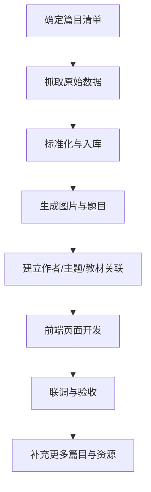

# AGENTS.md

## 项目目标

打造一个面向中小学生的古诗词与古文学习平台，覆盖唐诗三百首、宋词三百首、古文观止，以及中小学教材常见与必学篇目。产品重点不是“资料堆砌”，而是：

- 让学生轻松学懂
- 让学习过程有游戏感、奖励感、连续闯关感
- 让每篇作品都具备内容讲解、图像辅助、练习巩固与相关推荐
- 让所有数据、图片、题目、元数据都本地可控、可追溯、可扩展

---

## AI 协作总原则

1. **先结构化，再批量化。** 先确定数据结构、页面结构、资源命名，再批量采集和生成。
2. **先版权清晰，再入库。** 任何图片、古画、书法、音频、视频素材必须记录来源、许可、下载日期、原始链接。
3. **先本地存储，再页面使用。** 不允许线上热链作为正式资源；正式资源必须下载到仓库本地或本地数据库中。
4. **先学生体验，再炫技。** 每个页面优先保证“好懂、轻松、愿意继续看”。
5. **先移动端，再桌面端。** 所有页面先按手机竖屏体验设计，再增强到平板与桌面。
6. **先开放栈，再谈效率。** 代码不得依赖闭源第三方 SDK；可使用成熟开源库。
7. **先安全隔离，再接入能力。** API Key、Token、Cookie、私钥等严禁写入代码仓库。

---

## 仓库协作边界

### 允许使用
- 开源前端框架与组件库
- 开源数据库与 ORM
- 开源搜索、动画、图像处理、内容解析工具
- 本地脚本批处理与离线数据构建

### 禁止事项
- 禁止把密钥硬编码到源码、脚本、示例文件
- 禁止把版权不明图片直接收录入仓库
- 禁止直接复制来源不明的赏析、教辅解析内容
- 禁止把临时抓取数据直接当正式数据发布
- 禁止引入闭源 SDK 作为核心依赖

---

## 建议协作分工

### 1. 内容采集团队
负责：
- 收集唐诗三百首、宋词三百首、古文观止、中小学必学古诗文清单
- 拉取正文、作者、朝代、注释、译文、题解、出处
- 形成 `data/raw/` 原始数据与 `data/processed/` 标准化数据

### 2. 内容结构化团队
负责：
- 定义统一 schema
- 建立作品、作者、主题、教材、题目、资源、关系图谱
- 做去重、纠错、别名映射、教材映射

### 3. 视觉资产团队
负责：
- 为每篇作品生成意境图
- 收集历史古画、书法、文物图像
- 保存 `source_url`、`license`、`credit`、`local_path`

### 4. 产品前端团队
负责：
- 首页、搜索页、分类页、详情页、练习页、成就页
- 移动端刷页式交互、卡片流布局、奖励动画
- 响应式适配与性能优化

### 5. API / 数据团队
负责：
- 内容 API、搜索 API、练习 API、推荐 API、进度 API
- 本地数据库建模、索引、缓存、全文检索

---

## 统一工程约定

### 技术约定
- 全仓库默认使用 **TypeScript**
- API 输入输出必须有 schema 校验
- 所有内容资源使用明确 ID，不依赖标题做主键
- 图片、题目、关系数据一律结构化入库
- 所有脚本应可重复执行，避免一次性手工流程

### 命名约定
- 作品 ID：`work_<source>_<slug>`
- 作者 ID：`author_<slug>`
- 资源 ID：`asset_<type>_<slug>`
- 题目 ID：`quiz_<workid>_<index>`
- 关系 ID：`rel_<from>_<to>_<type>`

### 数据文件建议
- `data/raw/`：原始抓取结果，不人工改写
- `data/processed/`：标准化 JSON / JSONL / CSV
- `public/images/generated/`：AI 生成图片
- `public/images/historical/`：古画、书法、文物等历史素材
- `public/audio/`：朗读、配乐、音效

---

## 安全规范（必须遵守）

### Secrets
- 所有密钥仅能存在于 `.env.local`、系统环境变量或本地 secret 管理中
- `.env*` 必须加入 `.gitignore`
- 提交前检查日志、截图、导出文件中是否夹带敏感信息

### 素材版权
- 每个外部素材都必须记录：
  - 来源机构 / 页面
  - 原始链接
  - 下载日期
  - 许可类型
  - 署名要求
  - 是否允许商用 / 再分发
- 版权不明确的素材不得进入正式发布包

### 内容质量
- 译文、注释、赏析需要注明来源或标记为 AI 生成草稿
- AI 生成内容必须经过规则校验与人工抽检
- 面向学生的解释要避免过度学术化和歧义

---

## 推荐工作流

---

## Definition of Done

一个作品页要算“完成”，至少必须具备：

- 原文
- 拼音/断句（如适用）
- 作者简介
- 创作背景 / 题解
- 重点字词或句意解释
- 白话译文
- 至少 1 张本地图片
- 3~5 道练习题
- 答题反馈与激励动画
- 至少 3 条相关推荐
- 数据来源与资源元信息可追溯

---

## 当前阶段目标

当前优先做四件事：
1. 确定产品架构
2. 建立数据源清单
3. 统一设计规范
4. 搭起可扩展的工程骨架
