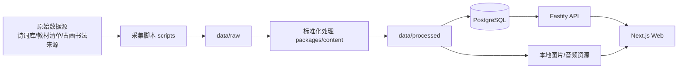
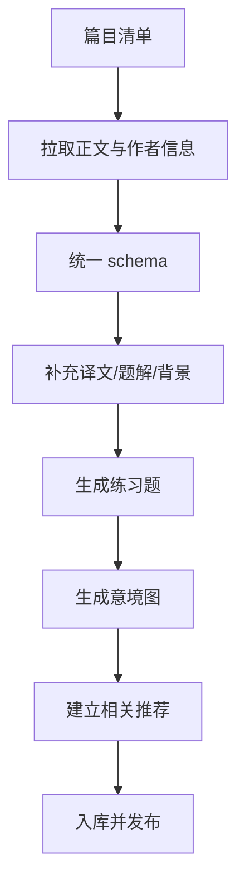

# ARCHITECTURE.md

## 一、产品定位

这是一个以“古诗词 / 古文轻松学习”为核心的内容型学习平台，目标是在**本地可控资源库**基础上，做出一个：

- 对学生更友好
- 对家长和老师更可信
- 对开发者更可维护
- 对未来 App / 桌面端扩展更友好的系统

---

## 二、核心范围

首期覆盖：
- 唐诗三百首
- 宋词三百首
- 古文观止
- 中小学教材常见与必学古诗文

每篇作品目标结构：
- 基础信息（标题、作者、朝代、体裁）
- 正文
- 注释 / 重点词句
- 创作背景 / 题解
- 白话译文
- 作者介绍
- AI 意境图
- 历史古画 / 书法 / 文物图片（如许可清晰）
- 3~5 道练习题
- 推荐关联作品

---

## 三、技术选型（推荐）

### 前端
- **Next.js + React + TypeScript**
- **Tailwind CSS**：快速构建统一视觉系统
- **shadcn/ui**：基础组件
- **Framer Motion**：页面过渡、奖励动效、轻量庆祝动画
- **TanStack Query**：客户端数据获取与缓存
- **Zustand**：轻量状态管理

### 后端 API
- **Fastify + TypeScript**
- **Zod**：请求/响应 schema 校验
- 采用模块化 API：内容、搜索、练习、推荐、用户进度

### 数据层
- **PostgreSQL**（本地可部署、开源、后续扩展性更强）
- **Drizzle ORM**：类型安全、迁移清晰
- 全文搜索：PostgreSQL FTS + `pg_trgm`

### 资源处理
- 本地文件系统存放图片、音频、视频、原始文本
- 脚本层负责采集、清洗、入库、生成派生资源

### AI 图像生成
- 默认优先选用**开源模型工作流**（如 SDXL / ComfyUI 一类的本地可控方案）
- 生成结果必须落地到本地目录，不依赖在线热链

---

## 四、为什么不用“纯前端静态站”

因为这个产品不仅是展示页，而是：
- 要做搜索
- 要做推荐
- 要做题目与学习进度
- 要做资源关联
- 将来要支持 App / 桌面端共用同一内容能力

所以建议一开始就采用：
**前端 + API + 数据库 + 本地资源仓库** 的标准分层架构。

---

## 五、推荐目录结构

```text
classics-learning-platform/
├── apps/
│   ├── web/                 # Next.js Web 前端
│   └── api/                 # Fastify API 服务
├── packages/
│   ├── ui/                  # 共享 UI 组件
│   ├── db/                  # schema、迁移、seed
│   └── content/             # 内容解析、推荐、题目生成逻辑
├── data/
│   ├── raw/                 # 原始抓取数据
│   └── processed/           # 标准化后的数据
├── public/
│   ├── images/
│   │   ├── generated/
│   │   └── historical/
│   └── audio/
├── scripts/                 # 抓取、清洗、导入、生成脚本
├── AGENTS.md
├── DESIGN.md
└── ARCHITECTURE.md
```

---

## 六、系统架构图



---

## 七、内容处理流水线



---

## 八、核心数据模型

### works 作品表
- id
- title
- dynasty
- author_id
- genre（诗 / 词 / 文 / 曲 / 赋）
- source_collection（唐诗三百首 / 宋词三百首 / 古文观止 / 教材）
- difficulty_level
- textbook_stage
- original_text
- translation_text
- background_text
- appreciation_text
- tags

### authors 作者表
- id
- name
- dynasty
- bio
- achievements
- avatar_asset_id（可选）

### assets 资源表
- id
- work_id
- asset_type（generated_image / historical_painting / calligraphy / audio / video）
- local_path
- source_url
- license
- credit
- prompt
- status

### quizzes 练习题表
- id
- work_id
- question_type
- stem
- options
- answer
- explanation
- difficulty

### relations 关联表
- id
- from_work_id
- to_work_id
- relation_type（同主题 / 同作者 / 同时代 / 同教材 / 同意象）
- score

### learning_progress 学习进度表
- id
- user_local_id
- work_id
- viewed
- mastered
- streak
- quiz_score
- reward_status

---

## 九、功能分层

### V1（先做）
- 首页
- 搜索
- 分类
- 作品详情页
- 练习题
- 基础激励反馈
- 本地数据管理

### V2
- 每日推荐
- 学习路径
- 收藏与错题本
- 更完整的作者/主题图谱
- 多图轮播、书法/古画专题

### V3
- 音频朗读
- AI 讲解音频 / 视频
- 桌面端封装（Tauri）
- App 端适配

---

## 十、推荐开发节奏

### Phase 0：策划与规范
- 完成 AGENTS.md
- 完成 DESIGN.md
- 完成数据源确认
- 确认 schema 与目录结构

### Phase 1：数据底座
- 建立篇目清单
- 编写采集脚本
- 统一结构化 JSON
- 完成数据库 schema

### Phase 2：MVP 前端
- 首页、分类页、搜索页、详情页
- 手机端优先适配
- 原文、译文、作者、背景、相关推荐打通

### Phase 3：游戏化与媒体增强
- 题目系统
- 成就与奖励动画
- 图片批量生成
- 古画/书法资源页

### Phase 4：多端扩展
- 桌面端封装
- App 复用 API 与内容层

---

## 十一、关键架构决策

1. **数据库优先，不做纯 Markdown 拼装站**：后续搜索、推荐、学习进度更稳。
2. **移动端优先**：详情页采用“分块刷读”体验。
3. **本地资源优先**：所有正式资源可追溯且能脱离外部站点运行。
4. **内容与展示分离**：文本、题目、图片、关系图谱独立存储。
5. **开源依赖优先**：避免把核心能力绑在闭源平台 SDK 上。

---

## 十二、当前建议的下一步

下一阶段直接执行：
1. 产出首批篇目清单
2. 编写采集与标准化脚本
3. 初始化数据库 schema
4. 搭建 Web 首页、搜索页和作品详情页原型
