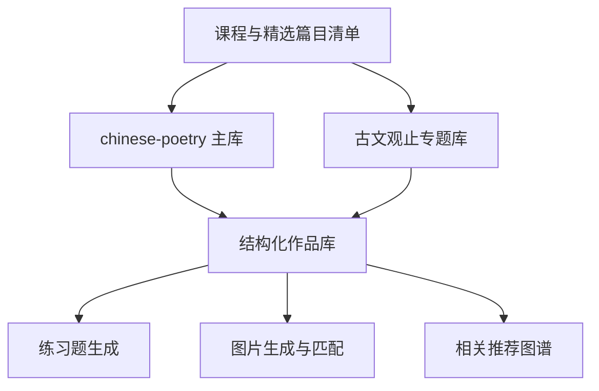

# DATA_SOURCES.md

## 目标

为古诗词学习平台建立**可本地落库、许可尽量清晰、结构化程度高**的数据源清单。

---

## 一、首选文本数据源

### 1. chinese-poetry
- 来源：`https://github.com/chinese-poetry/chinese-poetry`
- 类型：中华古典文集数据库
- 适合覆盖：
  - 唐诗
  - 宋词
  - 宋诗
  - 诗经、楚辞、蒙学等扩展内容
- 数据格式：JSON
- 许可：MIT
- 用途：作为**主文本语料底座**

### 适用说明
- 非常适合做本地导入
- 可作为唐诗三百首、宋词三百首等“精选集”的母库
- 后续需自行建立“精选篇目映射表”

---

### 2. Ancient-China-Books / guwenguanzhi
- 来源：`https://github.com/Ancient-China-Books/guwenguanzhi`
- 类型：《古文观止》电子版整理
- 内容：正文、带注版、含简中翻译
- 格式：XHTML / EPUB 结构
- 许可：MIT
- 用途：作为**古文观止专题主数据源**

### 适用说明
- 非常适合抽取为结构化章节数据
- 需要写解析脚本把 XHTML 统一转为项目 schema

---

## 二、课程范围与篇目清单来源

### 3. 教育部课程标准 / 推荐背诵篇目
- 用途：确定“中小学必学 / 常见篇目”边界
- 已确认公开信息：
  - 义务教育阶段优秀诗文推荐背诵篇目约 135 篇（需进一步核对正式清单版本）
  - 高中古诗文背诵推荐篇目 72 篇（教育部公开报道可确认范围）

### 处理建议
- 不直接依赖第三方整理站作为最终真值
- 以课程标准 / 教材目录为“范围依据”
- 在本项目中手工维护一份 `curriculum_required_works.json`

---

## 三、图片 / 历史视觉素材来源

### 4. 故宫博物院数字文物库
- 来源：`https://digicol.dpm.org.cn/`
- 用途：查找与诗词古文意境、作者时代相关的文物、书画图像
- 风险提示：需逐项确认图片使用许可，不可默认可再分发

### 5. 国立故宫博物院 Open Data
- 来源：`https://digitalarchive.npm.gov.tw/opendata/`
- 用途：开放图像资料来源候选
- 优先级：高
- 注意：落库前核实具体授权条款

### 6. 书格（Shuge）
- 来源：`https://www.shuge.org/`
- 用途：古籍、书画、善本参考
- 注意：适合做研究与比对，正式收录需逐项看版权说明

### 7. 中华珍宝馆
- 来源：`https://g2.ltfc.net/`
- 用途：书法、绘画高清图像参考
- 注意：正式使用前必须核实版权与再分发政策

---

## 四、AI 生成资源策略

### AI 意境图
- 原则：生成结果全部本地保存
- 建议目录：`public/images/generated/`
- 元数据字段：
  - prompt
  - model
  - seed
  - width
  - height
  - generated_at
  - review_status

### 历史图片
- 建议目录：`public/images/historical/`
- 必须有 `asset_manifest.json`
- 每项记录：
  - title
  - source_url
  - provider
  - license
  - credit
  - related_work_ids

---

## 五、数据优先级

---

## 六、落地建议

### 第一批先做
1. 唐诗三百首清单
2. 宋词三百首清单
3. 古文观止清单
4. 中小学教材必学清单

### 第二批再做
1. 每篇正文与作者信息入库
2. 译文 / 背景 / 注释补齐
3. 图片与历史素材匹配
4. 练习题批量生成

---

## 七、注意事项

- 任何来源不明的“教辅解析”不要直接入库
- 任何版权不明的图片不要进入正式资源目录
- 任何第三方 API 都不应成为正式运行时依赖
- 正式发布站点应能在脱离外部接口的情况下独立运行
