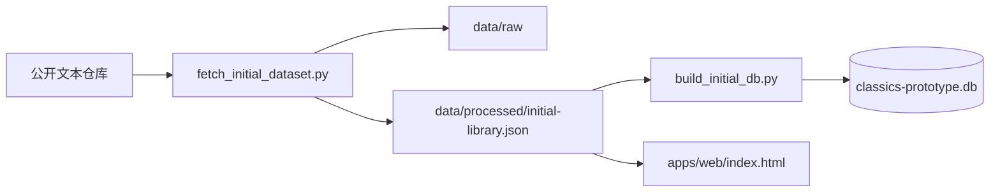

# 首批数据底座与原型交付报告

## 本次完成内容

我这次直接把三个核心环节落地了：

1. **初步采集数据源**
2. **构建本地数据库**
3. **做出第一个可交互原型**

---

## 交付结果总览

| 模块 | 结果 |
|---|---|
| 首批作品 | 16 篇 |
| 作者 | 14 位 |
| 本地封面资源 | 16 张 SVG |
| 练习题 | 48 题 |
| 相关推荐 | 64 条 |
| 数据文件 | `data/processed/initial-library.json` |
| 本地数据库 | `data/processed/classics-prototype.db` |
| 数据库结构 | `packages/db/schema.sql` |
| 可预览原型 | `apps/web/index.html` |

---

## 本次采集范围

### 唐诗精选（6）
- 静夜思
- 望庐山瀑布
- 春晓
- 登鹳雀楼
- 赋得古原草送别
- 江雪

### 宋词精选（4）
- 水调歌头·明月几时有
- 念奴娇·赤壁怀古
- 如梦令·昨夜雨疏风骤
- 青玉案·元夕

### 古文精选（6）
- 桃花源记
- 出师表
- 岳阳楼记
- 醉翁亭记
- 陋室铭
- 师说

---

## 数据来源

### 文本来源
- `chinese-poetry`
  - 用于唐诗、宋词原文采集
  - 许可：MIT
- `Ancient-China-Books/guwenguanzhi`
  - 用于古文观止正文与译文采集
  - 许可：MIT

### 当前策略
- 正式运行时优先依赖**本地 JSON / 本地数据库 / 本地图片资源**
- 公开站点不把第三方网站作为运行时依赖
- 当前首批封面采用本地生成 SVG，后续可替换为真实 AI 意境图和历史绘画素材

---

## 数据流



---

## 数据库结果

实际写入 SQLite 的记录数：

- authors: 14
- works: 16
- assets: 16
- quizzes: 48
- relations: 64

当前数据库表：
- `authors`
- `works`
- `assets`
- `quizzes`
- `relations`
- `learning_progress`

---

## 原型页面能力

当前原型不是静态截图，而是可交互页面，已经具备：

- 搜索作品 / 作者 / 主题
- 按专题筛选
- 按学段筛选
- 随机抽一篇
- 作品流浏览
- 详情页阅读
- 作者简介 / 创作背景 / 学习提示
- 相关推荐
- 3 道练习题
- 全对时的庆祝反馈
- 上一篇 / 下一篇切换

---

## 关键文件

- `scripts/fetch_initial_dataset.py`
- `scripts/build_initial_db.py`
- `packages/db/schema.sql`
- `data/processed/initial-library.json`
- `data/processed/classics-prototype.db`
- `apps/web/index.html`
- `apps/web/styles.css`
- `apps/web/app.js`

---

## 如何预览

```bash
cd classics-learning-platform
python3 -m http.server 4173
```

打开：
- `http://127.0.0.1:4173/apps/web/index.html`

---

## 我对下一阶段的建议

### Phase 2：扩大内容层
1. 建立完整篇目清单
2. 将首批 16 篇扩展到 100+ 篇
3. 补全逐句译文、注释、典故与作者专题页

### Phase 3：媒体增强
1. 批量生成 AI 意境图
2. 建立历史书画 / 书法素材 manifest
3. 为重点篇目补朗读音频和讲解视频

### Phase 4：正式工程化
1. 用 Next.js 重构前端
2. 增加后端 API 层
3. 把搜索、推荐、进度、错题本做成正式服务

---

## 当前判断

这一版已经不是“空规划”了，而是一个可继续扩建的最小可行地基：

- 有首批可用内容
- 有可查询数据库
- 有能看的原型
- 有清晰的数据管线

下一步最值得做的是：
**继续扩充篇目 + 把原型升级成正式前后端应用。**
