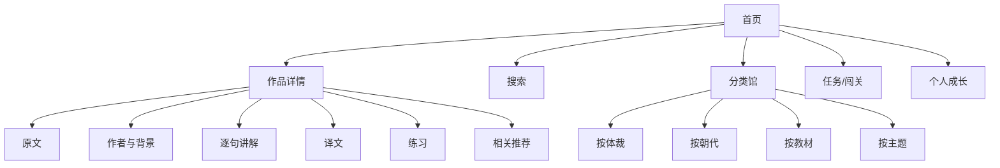

# DESIGN.md

## 设计目标

这是一个“让学生愿意反复打开”的古诗词学习网站。

它不应该像传统资料站那样密密麻麻，也不应该像教辅 PDF 的网页版。它应该像：
- 学习版 TikTok：一篇一篇轻松刷
- 学习版小红书：内容卡片清晰、图文并重、探索感强
- 学习版游戏任务系统：有目标、有反馈、有奖励、有收集欲

参考方向：现代移动端信息分层、卡片式排版、沉浸式首屏、适度留白、情绪化插画/视觉辅助。

---

## 目标用户

### 主用户
- 小学高年级学生
- 初中学生
- 高中学生

### 次用户
- 家长
- 语文老师
- 传统文化兴趣用户

---

## 设计关键词

- 轻松
- 有趣
- 不幼稚
- 有审美
- 有陪伴感
- 有成长感
- 有成就反馈
- 信息多但不拥挤

---

## 视觉原则

### 1. 内容比装饰更重要
页面装饰必须服务理解，不能喧宾夺主。诗词正文、译文、讲解、练习必须在视觉层级上清晰可读。

### 2. 一屏只讲一件事
尤其在手机端：
- 首屏先让学生进入作品意境
- 下滑再看作者与背景
- 再下滑看逐句讲解
- 再下滑进入练习与奖励

### 3. 用“卡片分段”解决长内容
一个作品页拆成多个内容卡片：
- 意境首屏卡
- 原文卡
- 作者背景卡
- 创作背景卡
- 逐句讲解卡
- 译文卡
- 典故/主题卡
- 图片/古画/书法卡
- 练习卡
- 相关推荐卡

### 4. 游戏化来自反馈，不来自噪音
奖励动画应短、明确、有成就感；不要让页面一直闪烁或堆满花哨特效。

---

## 移动端交互原则

### 主体验：竖屏刷页
每篇作品详情支持“沉浸式连续浏览”，类似短内容流：
- 上下滑切换信息段
- 左右滑可进入上一篇 / 下一篇
- 底部悬浮工具条提供：收藏、朗读、练习、随机下一首

### 次体验：探索式发现
- 首页提供主题入口、教材入口、作者入口、朝代入口
- 支持“今日一首”“随机一篇”“跟着课本学”“按情绪找诗词”

### 搜索体验
- 支持标题、作者、名句、主题、朝代、教材年级搜索
- 搜索结果优先展示：标题、作者、名句摘要、配图、难度标签
- 支持搜索建议和最近浏览

---

## 信息架构

---

## 页面设计要求

### 首页
- 顶部：一句欢迎语 + 搜索框
- 中部：今日推荐、教材专区、主题探索、随机挑战
- 下部：最近学习、成就进度、猜你喜欢

### 作品详情页
首屏建议包含：
- 题目
- 作者/朝代
- 主视觉图
- 1 句意境化引导语
- “开始学习”按钮

之后分区：
1. 原文与朗读
2. 重点字词
3. 创作背景
4. 白话译文
5. 古画/书法/相关图片
6. 练习题
7. 奖励反馈
8. 相关推荐

### 分类页
- 卡片化分类
- 每类带配图和作品数
- 支持难度筛选、学段筛选、主题筛选

### 练习页
- 单题聚焦展示
- 即时反馈
- 连对奖励
- 完成后出现庆祝动效、进度徽章、推荐下一篇

---

## 游戏化系统

### 激励机制
- 首次完成作品学习：点亮一枚“诗文星”
- 连续答对 3 题：触发轻量庆祝动画
- 连学 7 天：获得主题徽章
- 完成某专题：解锁“山水诗小达人”“豪放词入门者”等称号

### 奖励设计
- 优先使用微动效、粒子、徽章、光晕、卡片翻转
- 避免过度儿童化的卡通堆砌
- 奖励不打断学习节奏，时长建议 1~2 秒

---

## 视觉系统建议

### 色彩
- 主色：国风青绿 / 墨青
- 强调色：丹砂红 / 金色
- 背景色：米白 / 浅宣纸色
- 成功反馈：暖金 + 微粒子
- 错误反馈：柔和橙红，不刺眼

### 字体
- 正文优先高可读中文字体
- 标题可适度使用有书卷气但现代的字体
- 不能牺牲移动端阅读效率

### 插图风格
- AI 生成图：统一“清雅、东方、留白、叙事感”方向
- 历史古画/书法：保留原作质感，并明确来源说明
- 避免低质拼贴感

---

## 响应式要求

- **手机优先**：360px ~ 430px 作为主要设计基准
- 平板：增强双栏信息密度
- 桌面：允许侧边导航、目录浮层、相关推荐栏

---

## 动效原则

- 页面过渡要轻，不拖沓
- 学习相关动效优先服务理解
- 奖励动效优先服务情绪反馈
- 首屏主视觉可有轻微视差或浮动，不要喧宾夺主

---

## 无障碍与可读性

- 正文行高充足
- 支持字号切换
- 颜色对比符合可读性要求
- 触控区域足够大
- 图片需有替代说明
- 音频、朗读与字幕要同步可用

---

## 设计验收标准

一个页面若满足以下条件，才算设计通过：
- 手机上单手可操作
- 5 秒内看懂当前页面核心用途
- 学生能自然找到“下一步”操作
- 内容再多也不显挤
- 奖励机制让人想继续学下一篇
