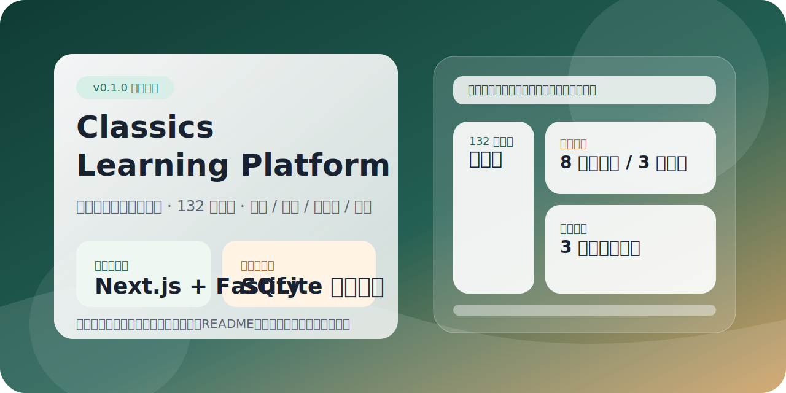
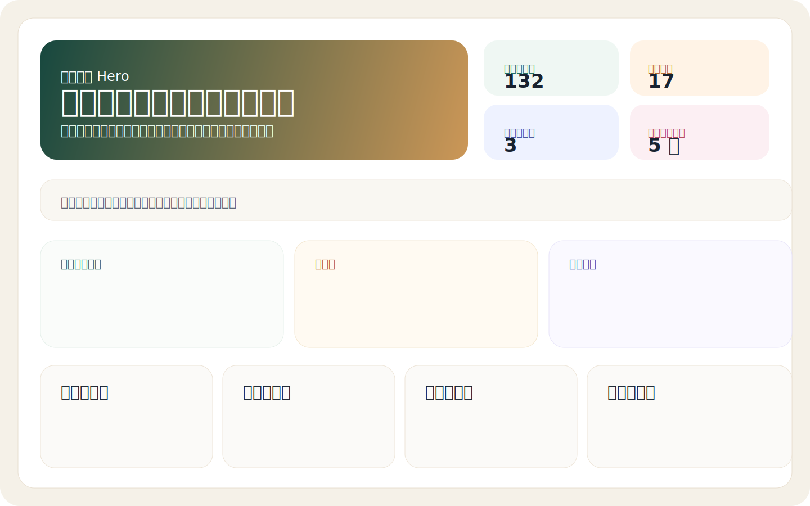
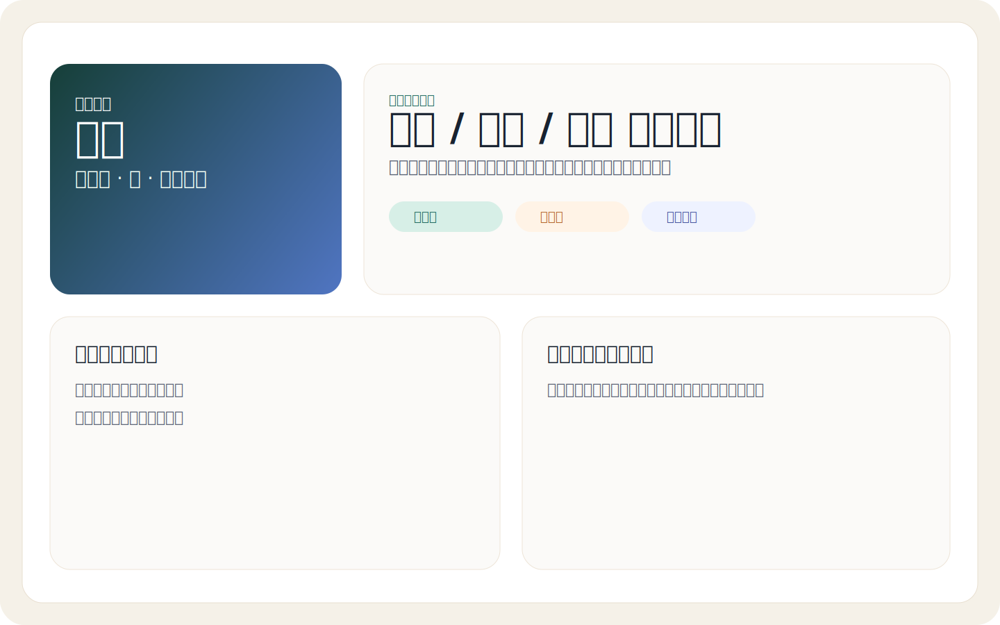
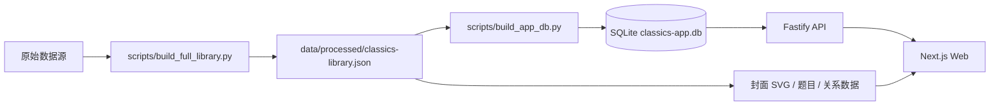

# Classics Learning Platform

> 一个面向中小学生的古诗词与古文学习平台。目标不是做“资料堆砌站”，而是把古典内容做成 **轻松、现代、可激励、可扩展** 的学习产品。



## 项目现状

当前仓库已经从“静态原型 + 首批数据”推进到一套更像正式开源项目的骨架：

- **132 篇作品内容库**：覆盖唐诗三百首、宋词三百首与首批古文精选
- **正式前后端结构**：`Next.js Web` + `Fastify API` + `SQLite`
- **学习系统雏形**：搜索、学习进度、错题本、成就系统已经贯通到 API 与前端页面
- **可重复数据构建**：支持从原始数据重新生成标准化 JSON、封面资源与应用数据库
- **开源仓库资产补齐**：MIT License、完整 README、仓库封面与效果图已经补上

## 效果图

| 首页 | 作品详情 |
| --- | --- |
|  |  |

## 技术栈

### 应用层
- **Web**: Next.js 15 + React 19 + TypeScript
- **API**: Fastify + Zod + TypeScript
- **Database**: SQLite

### 数据层
- Python 数据构建脚本
- 标准化 JSON 内容库
- 自动生成封面 SVG / 练习题 / 相关推荐

### 工程层
- npm workspaces
- 统一 TypeScript 基础配置
- 可重复构建的内容与数据库流水线

## 已实现功能

### 内容与检索
- 标题 / 作者 / 主题 / 名句全文检索
- 按专题、学段筛选作品
- 作品详情页展示原文、译文、背景、作者简介
- 基于标签 / 作者 / 专题 / 朝代生成相关推荐

### 学习系统
- 学习进度记录：已浏览、已掌握、答题得分、奖励等级
- 错题本：记录错误题目、订正状态与尝试次数
- 成就系统：按浏览数、掌握数、答题数、连续学习解锁徽章
- 演示用户：默认内置 `demo-user`，方便本地直接体验看板

### 内容资产
- 自动生成每篇作品的封面 SVG
- 自动生成每篇 3 道选择题
- 自动写入 SQLite 应用数据库

## 系统结构



## 目录结构

```text
classics-learning-platform/
├── apps/
│   ├── api/                 # Fastify + TypeScript API
│   ├── web/                 # Next.js 正式 Web 应用
│   └── prototype-web/       # 迁移保留的早期静态原型
├── data/
│   ├── raw/                 # 原始数据源与本地镜像
│   └── processed/           # 标准化 JSON 与 SQLite 数据库
├── docs/
│   ├── repo-cover.svg       # 仓库封面图
│   ├── home-screenshot.svg  # 首页效果图
│   └── detail-screenshot.svg
├── packages/
│   └── db/                  # SQLite schema
├── public/
│   └── images/generated/    # 自动生成封面资源
├── scripts/
│   ├── build_full_library.py
│   ├── build_app_db.py
│   └── build_initial_db.py
├── AGENTS.md
├── ARCHITECTURE.md
├── DATA_SOURCES.md
├── DESIGN.md
├── LICENSE
├── README.md
└── tsconfig.base.json
```

## 快速开始

### 1. 安装依赖

```bash
cd classics-learning-platform
npm install
```

### 2. 构建内容库与应用数据库

```bash
npm run build:data
```

这一步会生成：

- `data/processed/classics-library.json`
- `data/processed/classics-app.db`
- `public/images/generated/*.svg`

### 3. 启动开发环境

```bash
npm run dev
```

默认端口：

- Web: `http://127.0.0.1:3000`
- API: `http://127.0.0.1:4000`

### 4. 单独启动服务

```bash
npm run dev:web
npm run dev:api
```

## 环境变量

复制 `.env.example` 即可：

```bash
cp .env.example .env.local
```

关键变量：

- `NEXT_PUBLIC_API_BASE_URL`: Web 访问 API 的地址
- `PORT`: API 端口
- `CLASSICS_DB_PATH`: SQLite 数据库路径
- `DEMO_USER_ID`: 默认演示用户 ID

## 数据构建说明

### `scripts/build_full_library.py`
负责把现有首批精选内容扩展为正式内容库，主要做这些事：

- 从 `chinese-poetry` 选本读取唐诗 / 宋词
- 保留已有精选内容，按标题 + 作者去重
- 自动推导主题、学段、难度
- 自动生成封面 SVG
- 自动生成每篇 3 道练习题
- 自动建立相关推荐

### `scripts/build_app_db.py`
负责把标准化 JSON 写入 SQLite 应用数据库，并额外完成：

- 成就定义写入
- 演示用户学习进度种子数据写入
- 错题本示例记录写入

## API 概览

### 内容接口
- `GET /works`
- `GET /works/:slug`
- `GET /search?q=`
- `GET /collections`
- `GET /recommendations/:workId`
- `GET /quizzes/:workId`

### 学习接口
- `GET /progress/summary?userId=`
- `GET /progress/work/:workId?userId=`
- `POST /progress`
- `GET /mistakes?userId=`
- `POST /quiz-submissions`
- `GET /achievements?userId=`

## 当前版本范围（v0.1.0）

### 已完成
- 正式仓库结构与 License
- 132 篇内容扩展脚本
- SQLite 应用数据库构建脚本
- Fastify API 骨架
- Next.js Web 首页与作品详情页
- 搜索 / 学习进度 / 错题本 / 成就系统的首版打通

### 下一步优先级
1. 补全文本注释、逐句译文与重点字词解释
2. 引入每日推荐、学习路径与收藏系统
3. 加入音频朗读与媒体资源页
4. 提供更完整的测试与 CI 工作流
5. 增加教材映射与更细粒度搜索排序

## 相关文档

- `ARCHITECTURE.md`：系统架构与阶段路线
- `DESIGN.md`：统一视觉与交互原则
- `DATA_SOURCES.md`：公开数据源与素材策略
- `AGENTS.md`：协作、安全、开源依赖规范

## License

本项目基于 [MIT License](./LICENSE) 开源。
